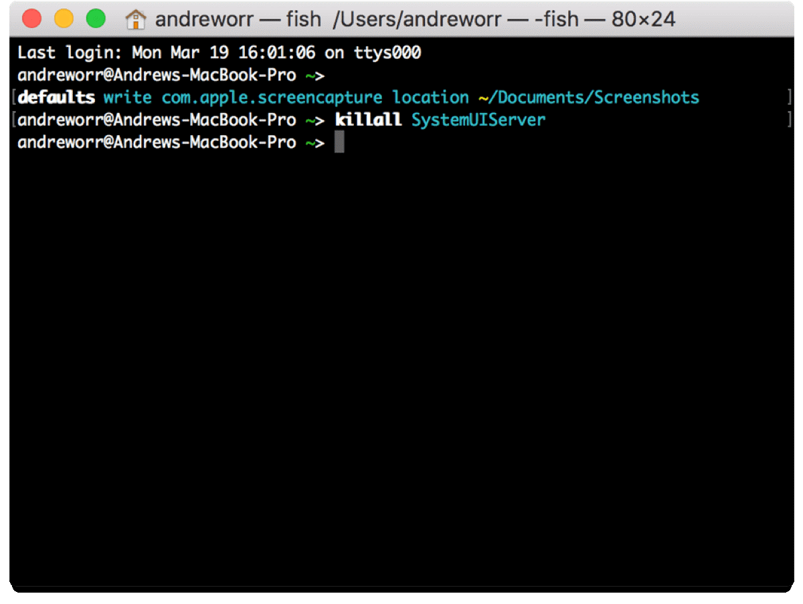
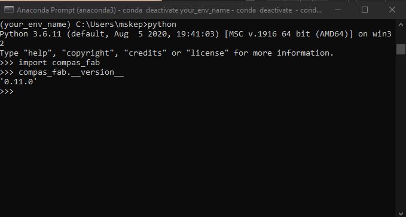

# Documentation
# **Part 1: Download Anaconda:**

_In this part you will download anaconda a python distribution. By downloading anaconda you receive everything you need to run python. If you are wondering what python is, it is a programing language. Here is python.org&#39;s_ [_definition_](https://www.python.org/doc/essays/blurb/)_._

1) Go to page: [https://www.anaconda.com/products/individual](https://www.anaconda.com/products/individual)
    1) Hit Download to take you to the location of the installation files 
    2. Install appropriate version<br/>
Mac users: graphical installer<br/>
       Window users: download the appropriate version  
      (If unsure of which version go to _Start button > Settings > System > About_)<br/> <br/>
       &nbsp; &nbsp; <br/> 

2. Open the Anaconda3 installer using default settings 
    1. Install for: Just Me 
    2. Destination Folder: this can be wherever 
    3. Advance options: none 
    4. Last page you may want to uncheck both boxes unless you want those pages to open in your browser 

# **Part 2: Use Anaconda prompt to download compas &amp; compas\_fab:**

_In this part you will use the command prompt (terminal if on mac) to install compas and compas\_fab (frameworks that will help you visualize the robots in rhino using grasshopper and python). You can read more about COMPAS and COMPAS\_FAB here:_ [_Compas\_fab_](https://gramaziokohler.github.io/compas_fab/latest/overview.html)_,_ [_Compas_](https://compas.dev/compas/index.html)_. For this installation we will be using a command prompt specific to anaconda (the program we installed in the previous step). It may look intimidating at first. However, once you understand how to use the command prompt/terminal, it can be a very useful tool. If you want to read more about why developers use the command prompt/terminal check_ _[this article](https://www.digitalcitizen.life/what-is-cmd)._

1. Open the anaconda prompt as an administrator
    1. Windows: type anaconda prompt in the windows search bar <br/>
     &nbsp; &nbsp; &nbsp; &nbsp; <br/>
    2. Mac: Open Launchpad, then click the terminal icon. <br/>
     &nbsp; &nbsp; &nbsp; &nbsp; <br/>
2. Now we will use the prompt to install compas and compas\_fab. In the anaconda prompt/terminal type in each of these lines found below (hitting enter after each line). You can optionally copy and paste **all** of the lines. Either use (_crtl v / cmd v_) depending on your computer. If that does not work try right clicking.

```console
conda config --add channels conda-forge
conda remove --name your_env_name --all
conda create -n your_env_name python=3.6 compas compas_fab --yes
conda activate your_env_name
python -m compas_rhino.install
python -m compas_fab.rhino.install -v 6.0
```
For the last two steps you will need to allow the anaconda prompt/terminal to make changes to local rhino files. So make sure you are logged in as an administrator.


_Explained below is what each line is does:_

```console 
(base) conda config --add channels conda-forge 
```
Adds the package conda-forge: _[https://conda-forge.org/#about](https://conda-forge.org/#about)_ <br/> <br/> 
```console 
(base) conda remove --name your\_env\_name --all 
``` 
Removes any environment with that name in preparation to create new one with updated version of python compas and compas\_fab <br/>  <br/>
 ```console 
 (base) conda create -n your\_env\_name python=3.6 compas compas\_fab --yes 
 ``` 
Creates a new python environment and installs compas and compas\_fab <br/>  <br/>
 ```console 
 (base) conda activate your\_env\_name
 ``` 
Actives the environment created in the previous step  <br/><br/> 
   ```console 
   (your\_env\_name) python -m compas\_rhino.install 
   (your\_env\_name) python -m compas\_fab.rhino.install -v 6.0 
   ```
Installs compas and compas_fab for rhino <br/><br/> 
* * *
3. Finally check to make sure that the installation worked by typing/copying and pasting the following code: <br/>

```console
python
import compas_fab
compas_fab.__version__
```
You should see:
```console
'0.11.0';
```


_In this step we are starting a python file, adding the package compas\_fab (which we installed in the previous step) and requesting the package&#39;s version. You should have installed the most current package. So a version of 0.11.0 or newer should be printed on the screen._ <br/><br/> 

    
# **Part 3: Downloading github &amp; files needed to run robots from grasshopper**

_In this part you will download github desktop. You will use this to get some repositories from the web that will help you work with the robots in grasshopper. We are using github desktop to retrieve these files because we want to clone them instead of downloading them. Cloning is similar to downloading but has the option to update the files if they are changed by the creator._ 

1) Download &amp; setup GitHub for desktop: [https://desktop.github.com](https://desktop.github.com/)
    1) The proper type of GitHub should appear (i.e. mac, windows x64, etc.) however if it does not just download the appropriate version for your computer.
    2) Click installer for Windows and double click the downloaded zip folder for Mac to install.
    3) Open GitHub desktop.
    4) If you have an account sign in. If not it is recommended that you make one.
2) Go to documents and find the GitHub folder
    1) This is where the repositories at default will be saved
    2) If you want you can create a subfolder for the repositories from this class (see part 3. v.)
3) Now we will clone two repositories that will allow us to us grasshopper and python to communicate to the robots _(To clone each repository it is going to be the same process except for the step iii.)_
    1) to file and select clone repository
    2) In the new window select the URL option
    3) Under repository URL type <br/>
        First time: [https://github.com/augmentedfabricationlab/ur\_online\_control.git](https://github.com/augmentedfabricationlab/ur_online_control.git) <br/> _These files will help you connect to the robots_ <br/>
        Second time: [https://github.com/augmentedfabricationlab/assembly\_information\_model](https://github.com/augmentedfabricationlab/assembly_information_model) <br/> _These files will help with creating the robot inside rhino_
    4) Make sure that the local path is correct. Depending on which repository you are downloading it should look something like ```C:\Users\name\Documents\GitHub\ur_online_control (or assembly_information_model)``` in Windows and ```\Users\name\Documents\GitHub\assembly_information_model``` in Mac
    5) _(Optional)_ If you created a subfolder change path to ```...\Documents\GitHub\name of your subfolder\ur_online_control (same with assembly_information_model)``` 
    


4) If these repositories need to be updated you can simply do it with GitHub desktop.
     1. First hit the down arrow beside the current repository and navigate to one of the two we cloned in the steps above.
     2. GitHub will automatically check to see if the files have been updated. If for some reason it does not, simply click Fetch origin.
     3. If there is an update, you see a blue box that says pull origin. Click that box and GitHub will update your files so that they match the creator&#39;s. This is why cloning is super useful!

    
# **Part 4: Adding these files to rhino**

_In part 2 when we downloaded compas and compas\_fab we had to add them to rhino. We now need to do that for the repositories we cloned as currently rhino cannot access them._ !

1) Open a new Rhino file
2) Type editpythonscript into the command line 
    1) This will open the python\_editor.
3) Go to tools → options
4) Add each src file from each of the two repositories installed
    1) To do so hit add to search path (circled in red in photo)
    2) Navigate through your folders to find one of the two repositories.
    3) Click on the repositories folder. Find and select the src folder and hit okay
    4) This should look like \Users\name\Documents\GitHub\ur_online_control\src or \Users\name\Documents\GitHub\assembly_information_mode\src
    5) Then using the up arrow bring that path to the top of the list
    6) Repeat with the second repository
5) Finally save the rhino file wherever you want. This makes it so that Rhino remembers the paths.
6) Done!
